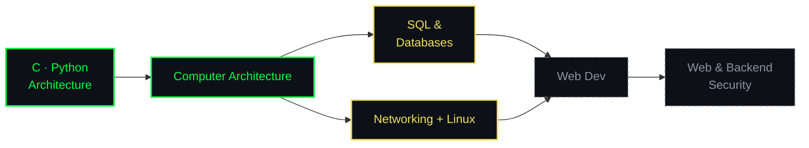

<div align="center">


<br>


</div>

<br>

## 🚀 About Me

> Computer science & digital engineering student, obsessed with understanding how systems really work — from the network layer down to the database. I learn by **building**, using my coursework and AI tools as accelerators, not shortcuts.

```yaml
yoka:
  university: "UIR — Engineering cycle, Computer Science & Digital Technologies (Year 1)"
  focus: ["Ethical Hacking", "Pentesting", "OSINT", "Cloud Security"]
  experience: "Networking internship — hands-on with real infrastructure"
  currently_studying: ["Databases & SQL", "Linux", "Computer Architecture"]
  learning_style: "Building > Reading"
  playing_with: ["Beginner CTFs", "Linux fundamentals", "Home lab"]
  open_to: ["Collaboration on small projects", "CTF teams", "Study groups"]
```

<br>

## 🎯 Current Roadmap

<div align="center">

| Area | What I'm doing | Level |
|:---|:---|:---:|
| 🛡️ **Cybersecurity** | Beginner CTFs, ethical hacking mindset, Linux tooling | 🟩🟩⬜⬜⬜ |
| 🌐 **Networking** | Internship done — deepening theory and practice | 🟩🟩🟩🟩⬜ |
| 🐧 **Linux** | Daily driver practice, shell, permissions, services | 🟩🟩🟩⬜⬜ |
| 🗄️ **Databases & SQL** | Fundamentals → schemas, queries, design | 🟩🟩⬜⬜⬜ |
| 🌍 **Web Dev** | HTML / CSS / JS, AI-assisted, ahead of coursework | 🟩🟩⬜⬜⬜ |
| 💻 **Core CS** | C, Python, Computer Architecture, Networking, Web Dev, Operating sys | 🟩🟩🟩⬜⬜ |

</div>

<details>
<summary><b>📋 Goals for the next months</b></summary>

- [ ] Finish a beginner path on TryHackMe / Hack The Box
- [ ] Build a home lab (VMs, segmented network, basic monitoring)
- [ ] Publish write-ups of the CTFs I solve
- [ ] Ship 2–3 real projects with clean READMEs
- [ ] Get comfortable with SQL beyond the basics

</details>

<br>

## 🛠 Tech Stack

<div align="center">


</div>

<br>

<div align="center">

**🎯 Interests**


<br>

**🤖 AI Learning Partners**


<br>

**🗣️ Languages**


</div>

<br>

## 🧭 My Path



<br>


## 📊 GitHub Stats

<div align="center">


<br>


<br>



</div>

<br>

## 🐍 Contribution Snake

<div align="center">

<picture>
  <source media="(prefers-color-scheme: dark)" srcset="https://raw.githubusercontent.com/Y0kina/Y0kina/output/github-contribution-grid-snake-dark.svg" />
  
</picture>

</div>

<br>

## 🎮 Beyond the Code

- 🕹️ **Gaming:** PC & console — I love the whole universe
- 🎬 **Anime:** always hunting for the next great series

<br>

## 📫 Let's Connect

<div align="center">

[](mailto:ahmed.alaabqary08@gmail.com)
[](https://www.linkedin.com/in/ahmed-al-aabqary-3922543b7/)
<br>

*"Stay curious. Stay humble. **Break it to understand it, build it to protect it.**"* ⚡


</div>
